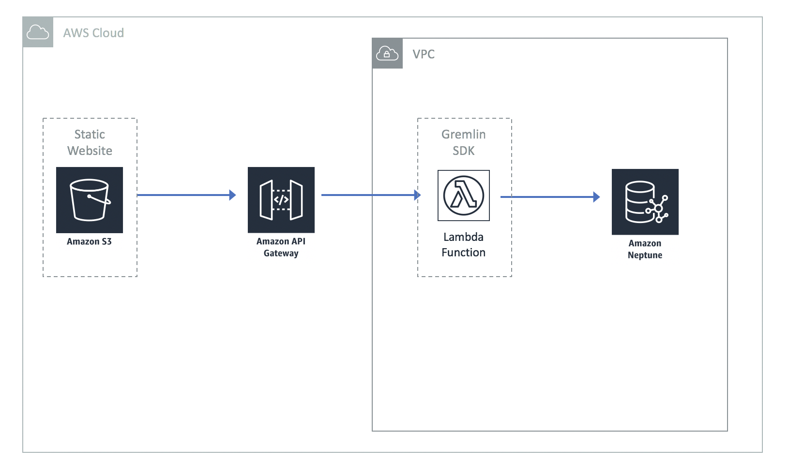

# Create a Web Front-End for Your Graph Application

## Description

This guide walks you through deploying a static website that leverages an API to make graph traversals against a graph hosted in an Amazon Neptune cluster.  The architecture uses:

- **API Gateway + Lambda** to query Neptune via the Gremlin client
- **CloudFront + private S3 bucket** to serve the React front-end securely using Origin Access Control (OAC)
- **SAM CLI** for local development and deployment

The Lambda function resides in the same VPC as the Neptune cluster, giving the Gremlin client direct access to the graph.



## Prerequisites

- [AWS SAM CLI](https://docs.aws.amazon.com/serverless-application-model/latest/developerguide/install-sam-cli.html)
- [Node.js](https://nodejs.org/)
- [GNU Make](https://www.gnu.org/software/make/)
- A deployed Neptune cluster using the [Neptune CloudFormation stack](https://docs.aws.amazon.com/neptune/latest/userguide/get-started-cfn-create.html) from the earlier portions of the workshop

## Data Collection

Before deploying, collect the following values from the existing "NeptuneBaseStack" CloudFormation stack outputs:

1. **VPC** — The VPC ID
2. **DBClusterEndpoint** — The Neptune cluster endpoint
3. **PublicSubnet1, PublicSubnet2, PublicSubnet3** — The three subnet IDs
4. **NeptuneSG** — The Neptune security group ID

## Local Development

### Initial Setup

Copy the example configuration files and fill in your values:

```bash
cp env.json.example env.json
cp website/public/api.json.example website/public/api.json
```

Edit `env.json` and set your Neptune cluster endpoint.  The `api.json` file defaults to `http://localhost:3001` and should not need changes for local development.  Both files are gitignored to prevent leaking environment-specific values.

### Running Locally

Start both the SAM local API and the React dev server together:

```bash
make local-dev
```

This runs the SAM local API on port 3001 and the React dev server on port 3000.  Browse to `http://localhost:3000` to use the application.

Note that the Lambda function needs to reach your Neptune cluster, so local invocations will only work if your machine has connectivity to the Neptune endpoint.  If your cluster has [public endpoints enabled](https://docs.aws.amazon.com/neptune/latest/userguide/neptune-public-endpoints.html), local development will work without any additional networking setup.  Otherwise, you will need VPN or similar connectivity to the VPC.

Your local AWS credentials must also have `neptune-db:ReadDataViaQuery` permission on the cluster for IAM-authenticated requests.

You can also run the pieces individually:

```bash
# SAM local API only
make local-api

# React dev server only
cd website && npm install && npm start
```

## Deploying to AWS

### 1. Deploy the stack

This deploys the Lambda function, API Gateway, S3 bucket, and CloudFront distribution in a single CloudFormation stack:

```bash
make deploy STACK_NAME=neptune-workshop
```

On first run, SAM will prompt for the parameter values collected above:
- **workshopNeptuneDB**: The DBClusterEndpoint value
- **workshopVPC**: The VPC ID
- **workshopSubnetIDs**: All three subnet IDs (comma-separated)

Subsequent deploys will reuse the saved configuration in `samconfig.toml`.

### 2. Allow Lambda to access Neptune

Add an inbound rule to the Neptune security group (NeptuneSG) to allow traffic from the Lambda function's security group:

1. In the EC2 console, navigate to Security Groups and find the Neptune security group.
2. Edit inbound rules and add:
    - **Type**: Custom TCP
    - **Port Range**: 8182
    - **Source**: The `workshopSecGroup` value from the stack outputs

### 3. Deploy the website content

This builds the React app, writes the API Gateway URL into `api.json` automatically, and syncs the build output to S3:

```bash
make sync STACK_NAME=neptune-workshop
```

Or do everything in one step:

```bash
make all STACK_NAME=neptune-workshop
```

The CloudFront URL will be printed at the end.

### Makefile Targets

| Target | Description |
|---|---|
| `make build` | Build Lambda (SAM) and React front-end |
| `make deploy` | Build and deploy the CloudFormation stack |
| `make sync` | Write api.json and sync website to S3 |
| `make all` | Full deploy: infrastructure + website content |
| `make local-api` | Start a local API Gateway for development |
| `make local-dev` | Start both SAM local API and React dev server |
| `make clean` | Remove build artifacts |

## Testing the Application

Browse to the CloudFront URL from the stack outputs and try entering actors such as 'Jack Nicholson', 'Tom Cruise', or 'Robert De Niro' in the actor field.  You should see both the graph traversal being used and the results (an array of paths from the actor to Kevin Bacon).

## Next Steps

Use the example here to build new functionality into this application or other use cases.  Many applications may have dozens of API calls with many different Lambda functions with different graph traversals in each Lambda function.  You can also use Lambda to load data into the graph database using g.addV(), g.addE(), or g.V().property() traversals.
